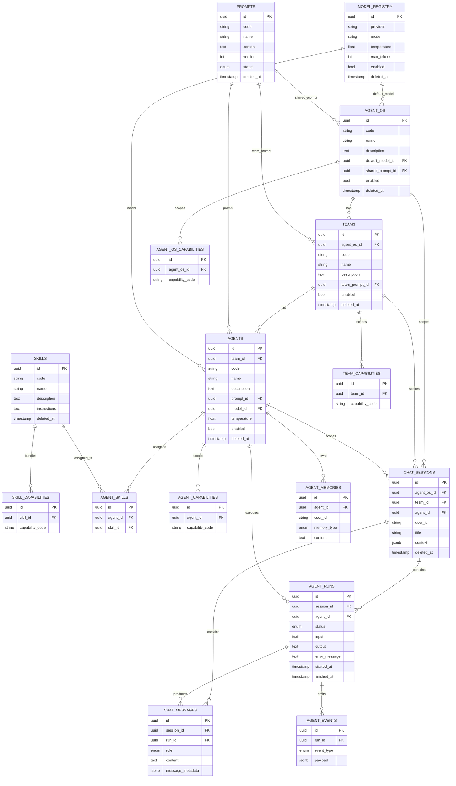

# Entity Relationship Diagram

This ERD reflects the schema created by `alembic/versions/0001_initial_schema.py`
and defined in `app/models/`. Render with any Mermaid-compatible viewer
(GitHub renders this natively).

## Notes

- **Soft delete** (`deleted_at`) applies to all metadata tables:
  `model_registry`, `prompts`, `agent_os`, `teams`, `agents`, `skills`.
  Runtime/audit tables (`chat_sessions` excluded, see below) do **not**
  soft-delete because they represent immutable history.
- `chat_sessions` *does* carry `deleted_at` (a session can be archived by
  an end user without losing the metadata trail), but `chat_messages`,
  `agent_runs`, and `agent_events` are append-only and never deleted -
  they are the permanent observability/audit trail for a run.
- `agent_memories` is deletable via `DELETE /api/v1/memories/{id}` (hard
  delete) since memory is explicitly mutable/forgettable by design.
- Capability assignment tables (`*_capabilities`) are pure association
  tables: no soft delete, replaced wholesale via `set_*_capabilities()`
  rather than incrementally patched, to keep the "current assignment"
  always queryable as one clean set per level.
